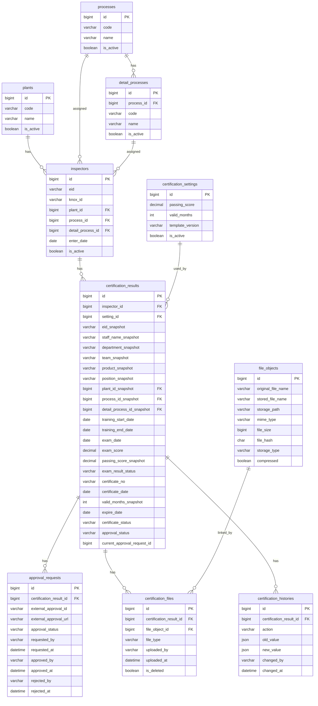

# Inspector Certification Management App — AI Coding Agent Guide

## 1. Purpose

Build a new **Inspector Certification Management** application.

The app manages:

- Inspector master list
- Plant / process / detail process master data
- Exam and certification result records
- Approval status mapping with an existing external approval system
- Certificate PDF upload
- Scanned paper exam PDF upload
- Certification history / audit log

This document is intended for an AI coding agent. Follow this design strictly unless the user explicitly changes the requirements.

---

## 2. Important Architecture Rules

### 2.1 HR database is read-only

There is an existing HR database table named:

```text
staffs_new
```

This table contains employee information such as:

- EID
- Knox ID / user ID
- Full name
- Email
- Department
- Team
- Product
- Position
- Employee status
- Join / leave information

The new app **must not update** `staffs_new`.

Use `staffs_new` only for reading employee data.

### 2.2 Do not create these tables

Do **not** create the following tables in the new app:

```text
staff_snapshot
products
certification_types
inspector_processes
email_templates
email_logs
reminder_schedules
```

Reasons:

- `staff_snapshot` is not required because current employee information can be read directly from `staffs_new`.
- `products` is not required because product information can be read directly from `staffs_new`.
- `certification_types` is not required because all employees use the same certification template/design.
- `inspector_processes` is not required for version 1.
- Email-related tables are not needed for the current scope.

### 2.3 Store business data in the new app database

The new app must store only its own business data:

- Inspector enrollment
- Certification results
- Approval mapping
- File metadata
- Audit history

### 2.4 Keep certificate historical data stable

Even though the app reads current employee data from `staffs_new`, each certification record must store a small snapshot of employee information at the time the certification is created/issued.

This prevents old certificates from changing when the employee later moves team, changes department, changes product, or leaves the company.

---

## 3. Final Tables

The new app database should contain exactly these core tables:

```text
1. plants
2. processes
3. detail_processes
4. inspectors
5. certification_settings
6. certification_results
7. approval_requests
8. file_objects
9. certification_files
10. certification_histories
```

---

## 4. Database Schema

The SQL below is written for MySQL 8+ style syntax. Adjust only if the actual project uses another database engine.

---

### 4.1 `plants`

Stores plant master data.

```sql
CREATE TABLE plants (
  id BIGINT UNSIGNED AUTO_INCREMENT PRIMARY KEY,
  code VARCHAR(50) NOT NULL,
  name VARCHAR(100) NOT NULL,
  is_active TINYINT(1) NOT NULL DEFAULT 1,
  created_at DATETIME NOT NULL DEFAULT CURRENT_TIMESTAMP,
  updated_at DATETIME NULL DEFAULT NULL ON UPDATE CURRENT_TIMESTAMP,

  UNIQUE KEY uk_plants_code (code),
  KEY idx_plants_active (is_active)
);
```

Example:

```text
code = P553
name = SEHC
```

---

### 4.2 `processes`

Stores main process master data.

```sql
CREATE TABLE processes (
  id BIGINT UNSIGNED AUTO_INCREMENT PRIMARY KEY,
  code VARCHAR(50) NOT NULL,
  name VARCHAR(100) NOT NULL,
  is_active TINYINT(1) NOT NULL DEFAULT 1,
  created_at DATETIME NOT NULL DEFAULT CURRENT_TIMESTAMP,
  updated_at DATETIME NULL DEFAULT NULL ON UPDATE CURRENT_TIMESTAMP,

  UNIQUE KEY uk_processes_code (code),
  KEY idx_processes_active (is_active)
);
```

Example:

```text
code = CS
name = Customer Satisfaction
```

---

### 4.3 `detail_processes`

Stores detail processes such as IQC, OQC, Mass.

```sql
CREATE TABLE detail_processes (
  id BIGINT UNSIGNED AUTO_INCREMENT PRIMARY KEY,
  process_id BIGINT UNSIGNED NOT NULL,
  code VARCHAR(50) NOT NULL,
  name VARCHAR(100) NOT NULL,
  is_active TINYINT(1) NOT NULL DEFAULT 1,
  created_at DATETIME NOT NULL DEFAULT CURRENT_TIMESTAMP,
  updated_at DATETIME NULL DEFAULT NULL ON UPDATE CURRENT_TIMESTAMP,

  CONSTRAINT fk_detail_processes_process
    FOREIGN KEY (process_id) REFERENCES processes(id),

  UNIQUE KEY uk_detail_processes_process_code (process_id, code),
  KEY idx_detail_processes_process (process_id),
  KEY idx_detail_processes_active (is_active)
);
```

Relationship:

```text
processes 1 - n detail_processes
```

---

### 4.4 `inspectors`

Stores employees who are registered as inspectors in this app.

Employee details are read from `staffs_new` by `eid` or `knox_id`.

```sql
CREATE TABLE inspectors (
  id BIGINT UNSIGNED AUTO_INCREMENT PRIMARY KEY,

  eid VARCHAR(50) NOT NULL,
  knox_id VARCHAR(100) NULL,

  plant_id BIGINT UNSIGNED NOT NULL,
  process_id BIGINT UNSIGNED NOT NULL,
  detail_process_id BIGINT UNSIGNED NOT NULL,

  enter_date DATE NULL,
  is_active TINYINT(1) NOT NULL DEFAULT 1,

  created_by VARCHAR(100) NULL,
  created_at DATETIME NOT NULL DEFAULT CURRENT_TIMESTAMP,
  updated_at DATETIME NULL DEFAULT NULL ON UPDATE CURRENT_TIMESTAMP,

  CONSTRAINT fk_inspectors_plant
    FOREIGN KEY (plant_id) REFERENCES plants(id),

  CONSTRAINT fk_inspectors_process
    FOREIGN KEY (process_id) REFERENCES processes(id),

  CONSTRAINT fk_inspectors_detail_process
    FOREIGN KEY (detail_process_id) REFERENCES detail_processes(id),

  UNIQUE KEY uk_inspectors_eid_detail_process (eid, detail_process_id),
  KEY idx_inspectors_eid (eid),
  KEY idx_inspectors_knox_id (knox_id),
  KEY idx_inspectors_active (is_active),
  KEY idx_inspectors_plant (plant_id),
  KEY idx_inspectors_process (process_id),
  KEY idx_inspectors_detail_process (detail_process_id)
);
```

Notes:

- `eid` should be the main mapping key to `staffs_new`.
- `knox_id` can be stored for convenience.
- Do not store full employee data here unless it is part of the inspector business domain.
- Current employee name, email, department, team, product should be read from `staffs_new` when needed.

---

### 4.5 `certification_settings`

Stores global certification rules.

This app currently uses one common certification template for all inspectors, so do not create `certification_types`.

```sql
CREATE TABLE certification_settings (
  id BIGINT UNSIGNED AUTO_INCREMENT PRIMARY KEY,

  passing_score DECIMAL(5,2) NOT NULL,
  valid_months INT NOT NULL,
  template_version VARCHAR(50) NOT NULL,

  is_active TINYINT(1) NOT NULL DEFAULT 1,

  created_by VARCHAR(100) NULL,
  created_at DATETIME NOT NULL DEFAULT CURRENT_TIMESTAMP,
  updated_at DATETIME NULL DEFAULT NULL ON UPDATE CURRENT_TIMESTAMP,

  KEY idx_certification_settings_active (is_active)
);
```

Example:

```text
passing_score = 95
valid_months = 24
template_version = v1
```

Rules:

- Use the active setting when creating a new certification result.
- Copy `passing_score` and `valid_months` into `certification_results` as snapshots.
- Do not hard-code passing score or valid duration in source code.

---

### 4.6 `certification_results`

Main business table.

Stores exam result, certificate information, approval status, and staff snapshot data at the time of certification.

```sql
CREATE TABLE certification_results (
  id BIGINT UNSIGNED AUTO_INCREMENT PRIMARY KEY,

  inspector_id BIGINT UNSIGNED NOT NULL,
  setting_id BIGINT UNSIGNED NULL,

  -- Staff snapshot at certification time
  eid_snapshot VARCHAR(50) NOT NULL,
  staff_name_snapshot VARCHAR(255) NULL,
  department_snapshot VARCHAR(255) NULL,
  team_snapshot VARCHAR(255) NULL,
  product_snapshot VARCHAR(255) NULL,
  position_snapshot VARCHAR(255) NULL,

  -- Business snapshot at certification time
  plant_id_snapshot BIGINT UNSIGNED NULL,
  process_id_snapshot BIGINT UNSIGNED NULL,
  detail_process_id_snapshot BIGINT UNSIGNED NULL,

  -- Training / exam information
  training_start_date DATE NULL,
  training_end_date DATE NULL,
  exam_date DATE NULL,
  exam_score DECIMAL(5,2) NULL,
  passing_score_snapshot DECIMAL(5,2) NULL,
  exam_result_status VARCHAR(30) NOT NULL DEFAULT 'NOT_TAKEN',

  -- Certificate information
  certificate_no VARCHAR(100) NULL,
  certificate_date DATE NULL,
  valid_months_snapshot INT NULL,
  expire_date DATE NULL,
  certificate_status VARCHAR(30) NOT NULL DEFAULT 'NOT_ISSUED',

  -- Approval information
  approval_status VARCHAR(30) NOT NULL DEFAULT 'DRAFT',
  current_approval_request_id BIGINT UNSIGNED NULL,

  remark TEXT NULL,

  created_by VARCHAR(100) NULL,
  created_at DATETIME NOT NULL DEFAULT CURRENT_TIMESTAMP,
  updated_at DATETIME NULL DEFAULT NULL ON UPDATE CURRENT_TIMESTAMP,

  CONSTRAINT fk_certification_results_inspector
    FOREIGN KEY (inspector_id) REFERENCES inspectors(id),

  CONSTRAINT fk_certification_results_setting
    FOREIGN KEY (setting_id) REFERENCES certification_settings(id),

  CONSTRAINT fk_certification_results_plant_snapshot
    FOREIGN KEY (plant_id_snapshot) REFERENCES plants(id),

  CONSTRAINT fk_certification_results_process_snapshot
    FOREIGN KEY (process_id_snapshot) REFERENCES processes(id),

  CONSTRAINT fk_certification_results_detail_process_snapshot
    FOREIGN KEY (detail_process_id_snapshot) REFERENCES detail_processes(id),

  KEY idx_certification_results_inspector (inspector_id),
  KEY idx_certification_results_eid_snapshot (eid_snapshot),
  KEY idx_certification_results_exam_status (exam_result_status),
  KEY idx_certification_results_approval_status (approval_status),
  KEY idx_certification_results_certificate_status (certificate_status),
  KEY idx_certification_results_certificate_date (certificate_date),
  KEY idx_certification_results_expire_date (expire_date)
);
```

Do not store `remaining_days`.

Calculate it dynamically:

```sql
DATEDIFF(expire_date, CURRENT_DATE)
```

---

### 4.7 `approval_requests`

Maps a certification result to an existing external approval system.

```sql
CREATE TABLE approval_requests (
  id BIGINT UNSIGNED AUTO_INCREMENT PRIMARY KEY,

  certification_result_id BIGINT UNSIGNED NOT NULL,

  external_approval_id VARCHAR(100) NULL,
  external_approval_url VARCHAR(1000) NULL,
  approval_status VARCHAR(30) NOT NULL DEFAULT 'WAITING_APPROVAL',

  requested_by VARCHAR(100) NULL,
  requested_at DATETIME NULL,

  approved_by VARCHAR(100) NULL,
  approved_at DATETIME NULL,

  rejected_by VARCHAR(100) NULL,
  rejected_at DATETIME NULL,
  reject_reason TEXT NULL,

  cancelled_by VARCHAR(100) NULL,
  cancelled_at DATETIME NULL,

  created_at DATETIME NOT NULL DEFAULT CURRENT_TIMESTAMP,
  updated_at DATETIME NULL DEFAULT NULL ON UPDATE CURRENT_TIMESTAMP,

  CONSTRAINT fk_approval_requests_certification_result
    FOREIGN KEY (certification_result_id) REFERENCES certification_results(id),

  KEY idx_approval_requests_certification_result (certification_result_id),
  KEY idx_approval_requests_external_id (external_approval_id),
  KEY idx_approval_requests_status (approval_status)
);
```

Relationship:

```text
certification_results 1 - n approval_requests
```

Reason:

- A certification can be rejected and submitted again.
- Each submission should create a new approval request record.
- `certification_results.current_approval_request_id` should point to the latest active approval request.

After creating this table, add the circular foreign key only if your migration strategy supports it safely:

```sql
ALTER TABLE certification_results
ADD CONSTRAINT fk_certification_results_current_approval_request
FOREIGN KEY (current_approval_request_id) REFERENCES approval_requests(id);
```

If circular foreign keys are inconvenient in the ORM, skip this foreign key and keep only the indexed column.

---

### 4.8 `file_objects`

Stores metadata of the physical file in storage.

Do not store PDF binary content in the database.

```sql
CREATE TABLE file_objects (
  id BIGINT UNSIGNED AUTO_INCREMENT PRIMARY KEY,

  original_file_name VARCHAR(255) NOT NULL,
  stored_file_name VARCHAR(255) NOT NULL,
  storage_path VARCHAR(1000) NOT NULL,

  mime_type VARCHAR(100) NOT NULL,
  file_size BIGINT UNSIGNED NOT NULL,
  file_hash CHAR(64) NOT NULL,

  storage_type VARCHAR(30) NOT NULL DEFAULT 'LOCAL',
  compressed TINYINT(1) NOT NULL DEFAULT 0,

  created_by VARCHAR(100) NULL,
  created_at DATETIME NOT NULL DEFAULT CURRENT_TIMESTAMP,

  UNIQUE KEY uk_file_objects_file_hash (file_hash),
  KEY idx_file_objects_storage_type (storage_type),
  KEY idx_file_objects_created_at (created_at)
);
```

Allowed `storage_type` values:

```text
LOCAL
NAS
MINIO
S3
```

Recommended hash:

```text
SHA-256
```

Use `file_hash` to prevent duplicate storage.

---

### 4.9 `certification_files`

Links files to certification results.

```sql
CREATE TABLE certification_files (
  id BIGINT UNSIGNED AUTO_INCREMENT PRIMARY KEY,

  certification_result_id BIGINT UNSIGNED NOT NULL,
  file_object_id BIGINT UNSIGNED NOT NULL,

  file_type VARCHAR(50) NOT NULL,

  uploaded_by VARCHAR(100) NULL,
  uploaded_at DATETIME NOT NULL DEFAULT CURRENT_TIMESTAMP,

  is_deleted TINYINT(1) NOT NULL DEFAULT 0,
  deleted_by VARCHAR(100) NULL,
  deleted_at DATETIME NULL,

  CONSTRAINT fk_certification_files_certification_result
    FOREIGN KEY (certification_result_id) REFERENCES certification_results(id),

  CONSTRAINT fk_certification_files_file_object
    FOREIGN KEY (file_object_id) REFERENCES file_objects(id),

  KEY idx_certification_files_certification_result (certification_result_id),
  KEY idx_certification_files_file_object (file_object_id),
  KEY idx_certification_files_file_type (file_type),
  KEY idx_certification_files_deleted (is_deleted)
);
```

Allowed `file_type` values:

```text
CERTIFICATE_PDF
PAPER_EXAM_SCAN_PDF
APPROVAL_ATTACHMENT
OTHER
```

Relationship:

```text
certification_results 1 - n certification_files
file_objects 1 - n certification_files
```

---

### 4.10 `certification_histories`

Stores audit trail.

```sql
CREATE TABLE certification_histories (
  id BIGINT UNSIGNED AUTO_INCREMENT PRIMARY KEY,

  certification_result_id BIGINT UNSIGNED NOT NULL,

  action VARCHAR(50) NOT NULL,
  old_value JSON NULL,
  new_value JSON NULL,

  changed_by VARCHAR(100) NULL,
  changed_at DATETIME NOT NULL DEFAULT CURRENT_TIMESTAMP,

  CONSTRAINT fk_certification_histories_certification_result
    FOREIGN KEY (certification_result_id) REFERENCES certification_results(id),

  KEY idx_certification_histories_certification_result (certification_result_id),
  KEY idx_certification_histories_action (action),
  KEY idx_certification_histories_changed_at (changed_at)
);
```

Allowed `action` values:

```text
CREATE
UPDATE
SUBMIT_APPROVAL
APPROVE
REJECT
CANCEL_APPROVAL
ISSUE_CERTIFICATE
UPLOAD_FILE
DELETE_FILE
REVOKE_CERTIFICATE
```

---

## 5. Status Definitions

Use clear separated statuses.

Do not use one generic `status` column for everything.

---

### 5.1 Exam result status

Column:

```text
certification_results.exam_result_status
```

Allowed values:

```text
NOT_TAKEN
PASSED
FAILED
```

Meaning:

- `NOT_TAKEN`: exam has not been completed.
- `PASSED`: exam score is greater than or equal to the passing score.
- `FAILED`: exam score is below the passing score.

---

### 5.2 Approval status

Columns:

```text
certification_results.approval_status
approval_requests.approval_status
```

Allowed values:

```text
DRAFT
WAITING_APPROVAL
APPROVED
REJECTED
CANCELLED
```

Meaning:

- `DRAFT`: certification result exists but has not been submitted for approval.
- `WAITING_APPROVAL`: approval request has been created and is pending.
- `APPROVED`: external approval completed successfully.
- `REJECTED`: external approval rejected.
- `CANCELLED`: approval request cancelled.

---

### 5.3 Certificate status

Column:

```text
certification_results.certificate_status
```

Allowed values:

```text
NOT_ISSUED
ACTIVE
EXPIRED
REVOKED
```

Meaning:

- `NOT_ISSUED`: certificate has not been issued yet.
- `ACTIVE`: certificate has been issued and is still valid.
- `EXPIRED`: certificate is past the expire date.
- `REVOKED`: certificate was manually revoked.

---

## 6. Business Rules

### 6.1 Creating an inspector

When creating an inspector:

1. Search employee from `staffs_new`.
2. Validate that the employee exists.
3. Save only inspector-specific fields into `inspectors`:
   - `eid`
   - `knox_id`
   - `plant_id`
   - `process_id`
   - `detail_process_id`
   - `enter_date`
4. Do not copy all employee fields into `inspectors`.

---

### 6.2 Creating a certification result

In the new logic, adding a new certification for one inspector means creating a new `exam_results` row first.

The client should send only the fields that a user really enters:

- `inspector_id`
- `exam_id`
- `training_start_date`
- `training_end_date`
- `exam_date`
- `score`
- `remark` (optional)

The API should not ask the client to send these values manually during create:

- `exam_code_snapshot`
- `exam_title_snapshot`
- `part_code_snapshot`
- `passing_score_snapshot`
- `total_questions_snapshot`
- `certificate_valid_months_snapshot`
- `approval_status`
- `certificate_status`
- `certificate_no`
- `effective_date`
- `expire_date`
- `approved_by`

When creating a certification result:

1. Load the inspector from `inspectors`.
2. Load the selected exam from `exams`.
3. Load current employee data from `staffs_new` by `eid`.
4. Save one row into `exam_results`.
5. Copy exam snapshot fields from `exams` into `exam_results`:
   - `part_code_snapshot`
   - `exam_code_snapshot`
   - `exam_title_snapshot`
   - `passing_score_snapshot`
   - `total_questions_snapshot`
   - `certificate_valid_months_snapshot`
6. Save user input fields into `exam_results`:
   - `training_start_date`
   - `training_end_date`
   - `exam_date`
   - `score`
   - `remark`
7. Set exam result status:

```text
if score >= passing_score_snapshot:
    result_status = PASSED
else:
    result_status = FAILED
```

8. Set default approval/certificate state for the new record:
   - approval is still `DRAFT`
   - certificate is still `NOT_ISSUED`
9. Do not create an active certificate yet.
10. Do not create `certificate_results` on this create step.
11. Write audit log:
   - `action = UPDATE_EXAM_SCORE` if score is saved together with creation
   - or `action = CREATE` / equivalent create action if the project keeps a dedicated create event

Summary for Add New Certification form:

- Required user inputs:
  - Inspector
  - Exam
  - Training start date
  - Training end date
  - Exam date
  - Score
- Optional user inputs:
  - Remark
- Auto-filled by server:
  - Exam code
  - Passing score
  - Valid months
  - Approval status
  - Certificate status
- Not entered at create time:
  - Certificate No
  - Effective date
  - Expire date
  - Approver

---

### 6.3 Updating exam score

When updating `exam_score`:

```text
if exam_score >= passing_score_snapshot:
    exam_result_status = PASSED
else:
    exam_result_status = FAILED
```

Do not allow approval submission unless:

```text
exam_result_status = PASSED
```

---

### 6.4 Submitting approval

When submitting to the external approval system:

1. Create a request in the external approval system.
2. Insert one row into `approval_requests`.
3. Set:
   - `approval_requests.approval_status = WAITING_APPROVAL`
   - `certification_results.approval_status = WAITING_APPROVAL`
   - `certification_results.current_approval_request_id = approval_requests.id`
4. Write audit log:
   - `action = SUBMIT_APPROVAL`

---

### 6.5 Approval callback or sync

When external approval is approved:

1. Update `approval_requests.approval_status = APPROVED`.
2. Update `certification_results.approval_status = APPROVED`.
3. Issue the certificate:
   - set `certificate_date`
   - set `expire_date = certificate_date + valid_months_snapshot`
   - set `certificate_status = ACTIVE`
4. Write audit log:
   - `action = APPROVE`
   - `action = ISSUE_CERTIFICATE`

When external approval is rejected:

1. Update `approval_requests.approval_status = REJECTED`.
2. Update `certification_results.approval_status = REJECTED`.
3. Keep:
   - `certificate_status = NOT_ISSUED`
4. Write audit log:
   - `action = REJECT`

---

### 6.6 Certificate expiration

Do not update every row daily just to calculate remaining days.

For display:

```sql
SELECT
  *,
  DATEDIFF(expire_date, CURRENT_DATE) AS remaining_days
FROM certification_results;
```

For filtering expired certificates:

```sql
WHERE expire_date < CURRENT_DATE
```

The app may display `certificate_status = EXPIRED` dynamically if `expire_date < CURRENT_DATE`, or update it using a scheduled job later. Version 1 can calculate it dynamically.

---

### 6.7 File upload

Supported file types for this scope:

```text
CERTIFICATE_PDF
PAPER_EXAM_SCAN_PDF
APPROVAL_ATTACHMENT
OTHER
```

Rules:

1. Accept PDF uploads.
2. Do not store PDF binary data in the database.
3. Store physical files in file server, NAS, MinIO, S3, or local storage.
4. Store only metadata in `file_objects`.
5. Link files to certification results using `certification_files`.
6. Soft-delete files using `is_deleted`, `deleted_by`, and `deleted_at`.
7. Write audit log:
   - `action = UPLOAD_FILE`
   - `action = DELETE_FILE`

---

## 7. PDF Storage and Compression Guidelines

Goal:

```text
Reduce storage cost while keeping documents readable.
```

Recommended PDF policy:

```text
Scan DPI: 150 - 200 DPI
Color mode: grayscale
Image compression: JPEG
JPEG quality: 70% - 85%
```

For internal scanned paper exams:

```text
Use grayscale 200 DPI.
```

For normal certificate PDFs:

```text
Keep generated PDF as vector/text PDF if possible.
Avoid converting it to scanned image PDF.
```

Storage optimization rules:

1. Compute SHA-256 hash before saving.
2. If the same `file_hash` already exists in `file_objects`, do not store the physical file again.
3. Create only a new `certification_files` link to the existing `file_object`.
4. If uploaded PDF is large, compress it asynchronously.
5. Store whether the file was compressed using:
   - `file_objects.compressed = 1`
6. Avoid color scan unless required.
7. Generate small thumbnails/previews later if needed, but it is not required for version 1.

Recommended storage path format:

```text
/certifications/{yyyy}/{mm}/{certification_result_id}/{stored_file_name}
```

Example:

```text
/certifications/2026/06/10025/9f4a2c-certificate.pdf
```

---

## 8. Suggested Backend Modules

Use these modules/services in the backend.

```text
PlantModule
ProcessModule
DetailProcessModule
InspectorModule
CertificationSettingModule
CertificationResultModule
ApprovalRequestModule
FileModule
CertificationHistoryModule
StaffReaderModule
```

### 8.1 `StaffReaderModule`

This module reads from `staffs_new`.

Responsibilities:

- Search employee by EID / Knox ID / name
- Get employee detail
- Return only fields needed by the app
- Never update HR data

Example output DTO:

```ts
export interface StaffDto {
  eid: string;
  knoxId: string | null;
  fullName: string | null;
  email: string | null;
  department: string | null;
  team: string | null;
  product: string | null;
  position: string | null;
  status: string | null;
}
```

---

## 9. Suggested API Endpoints

Use REST or equivalent controller/service design.

### 9.1 Master data

```http
GET    /plants
POST   /plants
PATCH  /plants/:id
DELETE /plants/:id/soft

GET    /processes
POST   /processes
PATCH  /processes/:id

GET    /detail-processes
POST   /detail-processes
PATCH  /detail-processes/:id
```

### 9.2 Staff read-only

```http
GET /staffs/search?keyword=
GET /staffs/:eid
```

These endpoints must read from `staffs_new`.

### 9.3 Inspectors

```http
GET    /inspectors
POST   /inspectors
GET    /inspectors/:id
PATCH  /inspectors/:id
DELETE /inspectors/:id/soft
```

### 9.4 Certification results

```http
GET    /certifications
POST   /certifications
GET    /certifications/:id
PATCH  /certifications/:id
POST   /certifications/:id/submit-approval
POST   /certifications/:id/issue
POST   /certifications/:id/revoke
```

Recommended create request body:

```json
{
  "inspectorId": 1001,
  "examId": 12,
  "trainingStartDate": "2026-06-01",
  "trainingEndDate": "2026-06-05",
  "examDate": "2026-06-06",
  "score": 98,
  "remark": "Manual entry from migration or offline exam"
}
```

Recommended create response meaning:

- create one `exam_results` row
- derive `result_status` from `score` and exam passing score
- keep approval in `DRAFT`
- do not issue certificate yet
- return latest exam/certification snapshot for that inspector

### 9.5 Approval

```http
GET  /certifications/:id/approval-requests
POST /approval/callback
POST /approval/sync/:externalApprovalId
```

### 9.6 Files

```http
POST   /certifications/:id/files
GET    /certifications/:id/files
GET    /files/:id/download
DELETE /certifications/:id/files/:fileId
```

### 9.7 History

```http
GET /certifications/:id/histories
```

---

## 10. Frontend Screens

Recommended screens for version 1:

```text
1. Dashboard
2. Inspector List
3. Inspector Detail
4. Certification Result List
5. Certification Detail
6. Create / Edit Certification
7. Approval Status View
8. File Upload View
9. History View
10. Master Data Management
```

### 10.1 Dashboard should display

- Total inspectors
- Active certificates
- Expired certificates
- Certificates expiring soon
- Count by plant
- Count by detail process

Do not store dashboard numbers in database for version 1. Calculate them from queries.

### 10.2 Certification list should display

- EID
- Staff name
- Plant
- Process
- Detail process
- Team / department / product
- Exam score
- Exam result status
- Approval status
- Certificate status
- Certificate date
- Expire date
- Remaining days

`remaining_days` must be calculated, not stored.

---

## 11. Validation Rules

### 11.1 Inspector validation

- `eid` is required.
- `plant_id` is required.
- `process_id` is required.
- `detail_process_id` is required.
- `eid` must exist in `staffs_new`.
- Duplicate active inspector records for the same `eid + detail_process_id` should not be allowed.

### 11.2 Certification validation

- `inspector_id` is required.
- `exam_score` must be between 0 and 100.
- `training_end_date` must be greater than or equal to `training_start_date`.
- `certificate_date` cannot exist unless approval is approved.
- `expire_date` should be calculated from `certificate_date + valid_months_snapshot`.
- Do not submit approval if exam result is not `PASSED`.

### 11.3 File validation

- Accept PDF for:
  - `CERTIFICATE_PDF`
  - `PAPER_EXAM_SCAN_PDF`
- Reject executable files.
- Set a configurable max file size.
- Calculate SHA-256 hash.
- Store metadata in `file_objects`.
- Link to certification result in `certification_files`.

---

## 12. Security Notes

- Do not expose full HR employee data from `staffs_new`.
- Only return fields needed by the app.
- Restrict file downloads by permission.
- Validate file MIME type and extension.
- Store uploaded files outside the public web root.
- Use signed URLs or authenticated download endpoints if using object storage.
- Keep audit history for important actions.

---

## 13. Implementation Notes for AI Agent

When generating code:

1. Create database migrations for the 10 final tables.
2. Use constants/enums for statuses and file types.
3. Do not hard-code certification duration or passing score.
4. Use `certification_settings` for active rule values.
5. Use a read-only DB connection or repository for `staffs_new`.
6. Do not generate write/update/delete operations for `staffs_new`.
7. Do not create product, staff snapshot, certification type, inspector process, or email tables.
8. Do not store PDF binary data in the database.
9. Store file metadata and physical file path only.
10. Implement audit log creation for important actions.
11. Calculate `remaining_days` dynamically.
12. Copy employee snapshot data into `certification_results` at creation/issue time.
13. Keep approval workflow as mapping to the existing external approval system.

---

## 14. Recommended TypeScript Constants

```ts
export const ExamResultStatus = {
  NOT_TAKEN: 'NOT_TAKEN',
  PASSED: 'PASSED',
  FAILED: 'FAILED',
} as const;

export const ApprovalStatus = {
  DRAFT: 'DRAFT',
  WAITING_APPROVAL: 'WAITING_APPROVAL',
  APPROVED: 'APPROVED',
  REJECTED: 'REJECTED',
  CANCELLED: 'CANCELLED',
} as const;

export const CertificateStatus = {
  NOT_ISSUED: 'NOT_ISSUED',
  ACTIVE: 'ACTIVE',
  EXPIRED: 'EXPIRED',
  REVOKED: 'REVOKED',
} as const;

export const CertificationFileType = {
  CERTIFICATE_PDF: 'CERTIFICATE_PDF',
  PAPER_EXAM_SCAN_PDF: 'PAPER_EXAM_SCAN_PDF',
  APPROVAL_ATTACHMENT: 'APPROVAL_ATTACHMENT',
  OTHER: 'OTHER',
} as const;

export const FileStorageType = {
  LOCAL: 'LOCAL',
  NAS: 'NAS',
  MINIO: 'MINIO',
  S3: 'S3',
} as const;
```

---

## 15. Mermaid ERD



---

## 16. Acceptance Criteria

The implementation is acceptable when:

- The app has only the 10 core tables listed in this document.
- `staffs_new` is used as a read-only employee source.
- Creating a certification stores employee snapshot information.
- Approval can be submitted and tracked through `approval_requests`.
- Certificates are issued only after approval is approved.
- PDF files are stored outside the database.
- File metadata is stored in `file_objects`.
- File links are stored in `certification_files`.
- Duplicate file storage is avoided using SHA-256 hash.
- History records are created for important actions.
- `remaining_days` is calculated dynamically.
- No email feature is implemented in version 1.


---

## Addendum: Certificate Effective Date Rule

### Rule

The certificate effective date must be created only after the external approval is approved.

Do not issue a certificate while the approval request is still waiting.

### Recommended behavior

When the employee has passed the exam but the approval is still pending:

```text
exam_results.result_status = PASSED
approval_requests.approval_status = WAITING_APPROVAL
certificate_results should not be created yet
```

Alternative allowed behavior:

```text
certificate_results can be created early only if:
- certificate_status = NOT_ISSUED
- effective_date = NULL
- expire_date = NULL
```

However, the recommended approach is:

```text
Do not create certificate_results until approval is APPROVED.
```

### Effective date definition

When approval is approved:

```text
certificate_results.effective_date = approval_requests.approved_at date
certificate_results.expire_date = effective_date + valid_months
certificate_results.certificate_status = ACTIVE
```

Example:

```text
exam_date = 2026-06-01
requested_at = 2026-06-02
approved_at = 2026-06-05

effective_date = 2026-06-05
expire_date = 2028-06-05
```

### Important distinction

The system must treat these dates as different business events:

```text
exam_date       = the date the employee took the exam
requested_at   = the date approval was submitted
approved_at    = the date approval was completed
effective_date = the date the certificate officially becomes valid
expire_date    = effective_date + valid_months
```

### Reason

Before approval is completed, the certificate is not officially recognized by the system.

Using `approved_at` as the certificate effective date avoids these problems:

- The certificate becomes active only after official approval.
- The employee does not lose valid certificate days due to approval delay.
- The audit trail is clearer.
- The business flow is easier to explain and maintain.

### Business flow update

```text
1. Employee takes exam.
2. Exam score is saved.
3. If score >= passing_score, exam result becomes PASSED.
4. User submits approval request.
5. While approval is WAITING_APPROVAL:
   - no active certificate exists
   - effective_date is not set
   - expire_date is not set
6. When approval is APPROVED:
   - create certificate_results
   - set effective_date = approved_at date
   - set expire_date = effective_date + valid_months
   - set certificate_status = ACTIVE
7. If approval is REJECTED:
   - do not create an active certificate
   - certificate remains not issued
```

### Acceptance criteria update

The implementation is correct when:

```text
- A passed exam does not automatically create an active certificate.
- A certificate is issued only after approval is APPROVED.
- effective_date is based on approved_at, not exam_date.
- expire_date is calculated from effective_date.
- Pending approval records do not have an active certificate.
```
