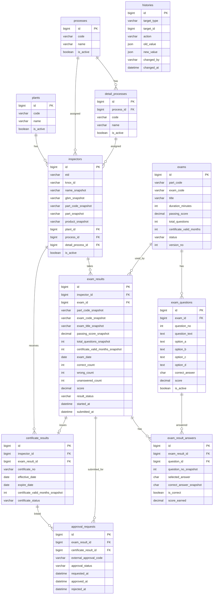

# Inspector Certification Management App — Full AI Coding Agent Guide

## 1. Purpose

Build a new **Inspector Certification Management** application.

The application manages:

- Inspector registration
- Plant / process / detail process master data
- MCQ exam management by Part
- ABCD question bank
- Inspector exam results
- Inspector selected answers
- External approval tracking
- Certificate issuing after approval
- Audit history

This document is intended for an AI coding agent. Follow this specification unless the user explicitly changes the business rules.

---

## 2. Current Scope

### In scope

The app must support:

- Inspectors mapped to employees from `staffs_new`
- One active/published exam per Part
- MCQ exam format only
- Four fixed answer choices: A, B, C, D
- Admin creates or imports questions into an exam
- Inspector takes the exam assigned to their Part
- Exam result is calculated automatically
- Passed exam can be submitted to an existing external approval system
- Certificate is issued only after approval is approved
- History/audit tracking

### Out of scope for current version

Do **not** create or implement these features in version 1:

- File upload for exam PDF
- File upload for paper exam scan
- File upload for certificate PDF
- `file_objects`
- `attachments`
- `staff_snapshot`
- `products`
- `certification_types`
- `inspector_processes`
- Email reminder tables
- Email template tables

The user already has a separate tool that can apply/import a PDF into MCQ questions, so this app only needs to store and manage the resulting exam/questions.

---

## 3. Existing HR Database Rule

There is an existing HR database table:

```text
staffs_new
```

The app must treat `staffs_new` as **read-only**.

The app may read employee data such as:

- `eid`
- `user` / Knox ID
- `fullName`
- `gbm`
- `part_code`
- `part`
- `product`
- `department`
- `team`
- `position`
- `status`

The app must **never** update, delete, or insert into `staffs_new`.

---

## 4. Final Table List

The new app database should contain these 11 core tables:

```text
1. inspectors
2. plants
3. processes
4. detail_processes
5. exams
6. exam_questions
7. exam_results
8. exam_result_answers
9. certificate_results
10. approval_requests
11. histories
```

---

## 5. Key Business Rules

### 5.1 Inspector rule

An inspector is an employee from `staffs_new` who is registered into this app.

The app stores:

- employee identifier
- snapshot of important employee information
- plant/process/detail process assigned in the app

### 5.2 Part-based exam rule

Each Part usually has only one current active/published exam.

```text
part_code -> one PUBLISHED exam
```

When an inspector takes an exam, the app must determine the exam by the inspector's Part.

### 5.3 MCQ-only rule

All exams are MCQ ABCD only.

Each question has:

```text
option_a
option_b
option_c
option_d
correct_answer = A | B | C | D
```

Do not create `exam_question_options` because the answer structure is fixed.

### 5.4 Exam result rule

An exam result belongs to:

```text
one inspector
one exam
```

Each selected answer is saved in `exam_result_answers`.

### 5.5 Approval rule

A passed exam does not automatically create an active certificate.

A passed exam can be submitted to the external approval system.

Only after external approval is approved, the app issues a certificate.

### 5.6 Certificate effective date rule

Use this rule:

```text
certificate_results.effective_date = approval_requests.approved_at date
certificate_results.expire_date = effective_date + certificate_valid_months
```

Do not use `exam_date` as the certificate effective date unless the business owner explicitly changes this rule.

---

## 6. Database Schema

The following SQL is written for MySQL 8+ style syntax.

---

# 6.1 `plants`

## Purpose

Master data for Plant.

## Columns

```sql
CREATE TABLE plants (
  id BIGINT UNSIGNED AUTO_INCREMENT PRIMARY KEY,

  code VARCHAR(50) NOT NULL,
  name VARCHAR(100) NOT NULL,

  is_active TINYINT(1) NOT NULL DEFAULT 1,

  created_at DATETIME NOT NULL DEFAULT CURRENT_TIMESTAMP,
  updated_at DATETIME NULL DEFAULT NULL ON UPDATE CURRENT_TIMESTAMP,

  UNIQUE KEY uk_plants_code (code),
  KEY idx_plants_active (is_active)
);
```

## Example

```text
code = P553
name = SEHC
```

---

# 6.2 `processes`

## Purpose

Master data for main Process.

## Columns

```sql
CREATE TABLE processes (
  id BIGINT UNSIGNED AUTO_INCREMENT PRIMARY KEY,

  code VARCHAR(50) NOT NULL,
  name VARCHAR(100) NOT NULL,

  is_active TINYINT(1) NOT NULL DEFAULT 1,

  created_at DATETIME NOT NULL DEFAULT CURRENT_TIMESTAMP,
  updated_at DATETIME NULL DEFAULT NULL ON UPDATE CURRENT_TIMESTAMP,

  UNIQUE KEY uk_processes_code (code),
  KEY idx_processes_active (is_active)
);
```

## Example

```text
code = CS
name = Customer Satisfaction
```

---

# 6.3 `detail_processes`

## Purpose

Master data for detail process such as IQC, OQC, MASS.

## Columns

```sql
CREATE TABLE detail_processes (
  id BIGINT UNSIGNED AUTO_INCREMENT PRIMARY KEY,

  process_id BIGINT UNSIGNED NOT NULL,
  code VARCHAR(50) NOT NULL,
  name VARCHAR(100) NOT NULL,

  is_active TINYINT(1) NOT NULL DEFAULT 1,

  created_at DATETIME NOT NULL DEFAULT CURRENT_TIMESTAMP,
  updated_at DATETIME NULL DEFAULT NULL ON UPDATE CURRENT_TIMESTAMP,

  CONSTRAINT fk_detail_processes_process
    FOREIGN KEY (process_id) REFERENCES processes(id),

  UNIQUE KEY uk_detail_processes_process_code (process_id, code),
  KEY idx_detail_processes_process (process_id),
  KEY idx_detail_processes_active (is_active)
);
```

## Relationship

```text
processes 1 - n detail_processes
```

---

# 6.4 `inspectors`

## Purpose

Stores employees registered as inspectors in this app.

This table maps app data to `staffs_new` using `eid` or `knox_id`.

## Columns

```sql
CREATE TABLE inspectors (
  id BIGINT UNSIGNED AUTO_INCREMENT PRIMARY KEY,

  eid VARCHAR(50) NOT NULL,
  knox_id VARCHAR(100) NULL,

  -- Snapshot from staffs_new at the time the inspector is added
  name_snapshot VARCHAR(255) NULL,
  gbm_snapshot VARCHAR(255) NULL,
  part_code_snapshot VARCHAR(50) NULL,
  part_snapshot VARCHAR(255) NULL,
  product_snapshot VARCHAR(255) NULL,

  plant_id BIGINT UNSIGNED NOT NULL,
  process_id BIGINT UNSIGNED NOT NULL,
  detail_process_id BIGINT UNSIGNED NOT NULL,

  remark TEXT NULL,
  is_active TINYINT(1) NOT NULL DEFAULT 1,

  created_by VARCHAR(100) NULL,
  created_at DATETIME NOT NULL DEFAULT CURRENT_TIMESTAMP,
  updated_at DATETIME NULL DEFAULT NULL ON UPDATE CURRENT_TIMESTAMP,

  CONSTRAINT fk_inspectors_plant
    FOREIGN KEY (plant_id) REFERENCES plants(id),

  CONSTRAINT fk_inspectors_process
    FOREIGN KEY (process_id) REFERENCES processes(id),

  CONSTRAINT fk_inspectors_detail_process
    FOREIGN KEY (detail_process_id) REFERENCES detail_processes(id),

  UNIQUE KEY uk_inspectors_eid_detail_process (eid, detail_process_id),
  KEY idx_inspectors_eid (eid),
  KEY idx_inspectors_knox_id (knox_id),
  KEY idx_inspectors_part_code_snapshot (part_code_snapshot),
  KEY idx_inspectors_plant (plant_id),
  KEY idx_inspectors_process (process_id),
  KEY idx_inspectors_detail_process (detail_process_id),
  KEY idx_inspectors_active (is_active)
);
```

## Notes

- `eid` is recommended as the main stable employee key.
- `knox_id` is useful for user lookup/login.
- `name_snapshot`, `gbm_snapshot`, `part_snapshot`, `product_snapshot` are stored so old inspector records stay understandable even if `staffs_new` changes.
- Current employee data can still be read from `staffs_new` when needed.

---

# 6.5 `exams`

## Purpose

Stores exam master data.

Each Part usually has one current published exam.

## Columns

```sql
CREATE TABLE exams (
  id BIGINT UNSIGNED AUTO_INCREMENT PRIMARY KEY,

  part_code VARCHAR(50) NOT NULL,

  exam_code VARCHAR(100) NOT NULL,
  title VARCHAR(255) NOT NULL,
  description TEXT NULL,

  duration_minutes INT NOT NULL,
  passing_score DECIMAL(5,2) NOT NULL,
  total_questions INT NOT NULL DEFAULT 0,

  certificate_valid_months INT NOT NULL DEFAULT 24,

  status VARCHAR(30) NOT NULL DEFAULT 'DRAFT',
  version_no INT NOT NULL DEFAULT 1,

  created_by VARCHAR(100) NULL,
  published_by VARCHAR(100) NULL,
  published_at DATETIME NULL,
  archived_by VARCHAR(100) NULL,
  archived_at DATETIME NULL,

  created_at DATETIME NOT NULL DEFAULT CURRENT_TIMESTAMP,
  updated_at DATETIME NULL DEFAULT NULL ON UPDATE CURRENT_TIMESTAMP,

  UNIQUE KEY uk_exams_exam_code (exam_code),
  UNIQUE KEY uk_exams_part_version (part_code, version_no),
  KEY idx_exams_part_code (part_code),
  KEY idx_exams_status (status),
  KEY idx_exams_part_status (part_code, status)
);
```

## Allowed status

```text
DRAFT
PUBLISHED
ARCHIVED
```

## Important rule

A Part should have only one `PUBLISHED` exam at a time.

Because MySQL does not support simple partial unique indexes like PostgreSQL, enforce this rule in the service layer using a transaction:

```sql
SELECT id
FROM exams
WHERE part_code = :partCode
  AND status = 'PUBLISHED'
FOR UPDATE;
```

Before publishing a new exam:

1. Lock existing published exam rows of the same Part.
2. Archive the old published exam if needed.
3. Publish the new exam.
4. Commit transaction.

## Example

```text
part_code = WM-IQC-P
exam_code = EX-001
title = Forklift Operation Safety Assessment
duration_minutes = 30
passing_score = 80
total_questions = 20
certificate_valid_months = 24
status = PUBLISHED
version_no = 1
```

---

# 6.6 `exam_questions`

## Purpose

Stores ABCD questions for an exam.

The app supports only MCQ ABCD.

## Columns

```sql
CREATE TABLE exam_questions (
  id BIGINT UNSIGNED AUTO_INCREMENT PRIMARY KEY,

  exam_id BIGINT UNSIGNED NOT NULL,

  question_no INT NOT NULL,
  question_text TEXT NOT NULL,

  option_a TEXT NOT NULL,
  option_b TEXT NOT NULL,
  option_c TEXT NOT NULL,
  option_d TEXT NOT NULL,

  correct_answer CHAR(1) NOT NULL,
  score DECIMAL(5,2) NOT NULL DEFAULT 1,

  explanation TEXT NULL,
  is_active TINYINT(1) NOT NULL DEFAULT 1,

  created_at DATETIME NOT NULL DEFAULT CURRENT_TIMESTAMP,
  updated_at DATETIME NULL DEFAULT NULL ON UPDATE CURRENT_TIMESTAMP,

  CONSTRAINT fk_exam_questions_exam
    FOREIGN KEY (exam_id) REFERENCES exams(id),

  UNIQUE KEY uk_exam_questions_exam_question_no (exam_id, question_no),
  KEY idx_exam_questions_exam (exam_id),
  KEY idx_exam_questions_active (is_active)
);
```

## Allowed `correct_answer`

```text
A
B
C
D
```

## Notes

Do not create `exam_question_options`.

Because the exam format is fixed to ABCD, storing A/B/C/D directly in `exam_questions` is simpler and better for this app.

---

# 6.7 `exam_results`

## Purpose

Stores the result of one inspector taking one exam.

## Columns

```sql
CREATE TABLE exam_results (
  id BIGINT UNSIGNED AUTO_INCREMENT PRIMARY KEY,

  inspector_id BIGINT UNSIGNED NOT NULL,
  exam_id BIGINT UNSIGNED NOT NULL,

  -- Snapshot at exam time
  part_code_snapshot VARCHAR(50) NULL,
  exam_code_snapshot VARCHAR(100) NULL,
  exam_title_snapshot VARCHAR(255) NULL,
  passing_score_snapshot DECIMAL(5,2) NULL,
  total_questions_snapshot INT NULL,
  certificate_valid_months_snapshot INT NULL,

  training_start_date DATE NULL,
  training_end_date DATE NULL,
  exam_date DATE NULL,

  correct_count INT NOT NULL DEFAULT 0,
  wrong_count INT NOT NULL DEFAULT 0,
  unanswered_count INT NOT NULL DEFAULT 0,

  score DECIMAL(5,2) NULL,
  result_status VARCHAR(30) NOT NULL DEFAULT 'NOT_TAKEN',

  started_at DATETIME NULL,
  submitted_at DATETIME NULL,

  remark TEXT NULL,

  created_by VARCHAR(100) NULL,
  created_at DATETIME NOT NULL DEFAULT CURRENT_TIMESTAMP,
  updated_at DATETIME NULL DEFAULT NULL ON UPDATE CURRENT_TIMESTAMP,

  CONSTRAINT fk_exam_results_inspector
    FOREIGN KEY (inspector_id) REFERENCES inspectors(id),

  CONSTRAINT fk_exam_results_exam
    FOREIGN KEY (exam_id) REFERENCES exams(id),

  KEY idx_exam_results_inspector (inspector_id),
  KEY idx_exam_results_exam (exam_id),
  KEY idx_exam_results_part_code_snapshot (part_code_snapshot),
  KEY idx_exam_results_exam_date (exam_date),
  KEY idx_exam_results_result_status (result_status),
  KEY idx_exam_results_submitted_at (submitted_at)
);
```

## Allowed `result_status`

```text
NOT_TAKEN
PASSED
FAILED
```

## Score rule

Use a 100-point score scale:

```text
score = correct_count / total_questions_snapshot * 100
```

Then:

```text
if score >= passing_score_snapshot:
    result_status = PASSED
else:
    result_status = FAILED
```

## Notes

- Do not store exam file paths here.
- Do not store PDF data here.
- The exam has no upload in the current version.

---

# 6.8 `exam_result_answers`

## Purpose

Stores each answer selected by the inspector.

This is important for audit, review, and score recalculation.

## Columns

```sql
CREATE TABLE exam_result_answers (
  id BIGINT UNSIGNED AUTO_INCREMENT PRIMARY KEY,

  exam_result_id BIGINT UNSIGNED NOT NULL,
  question_id BIGINT UNSIGNED NOT NULL,

  question_no_snapshot INT NULL,
  question_text_snapshot TEXT NULL,

  selected_answer CHAR(1) NULL,
  correct_answer_snapshot CHAR(1) NOT NULL,

  is_correct TINYINT(1) NOT NULL DEFAULT 0,
  score_earned DECIMAL(5,2) NOT NULL DEFAULT 0,

  created_at DATETIME NOT NULL DEFAULT CURRENT_TIMESTAMP,
  updated_at DATETIME NULL DEFAULT NULL ON UPDATE CURRENT_TIMESTAMP,

  CONSTRAINT fk_exam_result_answers_exam_result
    FOREIGN KEY (exam_result_id) REFERENCES exam_results(id),

  CONSTRAINT fk_exam_result_answers_question
    FOREIGN KEY (question_id) REFERENCES exam_questions(id),

  UNIQUE KEY uk_exam_result_answers_result_question (exam_result_id, question_id),
  KEY idx_exam_result_answers_exam_result (exam_result_id),
  KEY idx_exam_result_answers_question (question_id),
  KEY idx_exam_result_answers_is_correct (is_correct)
);
```

## Allowed selected answer

```text
A
B
C
D
NULL
```

`NULL` means unanswered.

## Notes

Snapshot fields protect old exam result data if questions are later edited.

---

# 6.9 `certificate_results`

## Purpose

Stores certificate information after approval is approved.

Recommended behavior:

```text
Do not create certificate_results until approval is APPROVED.
```

Alternative allowed behavior:

```text
Create certificate_results earlier only if:
certificate_status = NOT_ISSUED
effective_date = NULL
expire_date = NULL
```

But the recommended approach is to create it only after approval approval.

## Columns

```sql
CREATE TABLE certificate_results (
  id BIGINT UNSIGNED AUTO_INCREMENT PRIMARY KEY,

  inspector_id BIGINT UNSIGNED NOT NULL,
  exam_result_id BIGINT UNSIGNED NOT NULL,

  certificate_no VARCHAR(100) NULL,

  effective_date DATE NULL,
  expire_date DATE NULL,
  certificate_valid_months_snapshot INT NULL,

  certificate_status VARCHAR(30) NOT NULL DEFAULT 'NOT_ISSUED',

  remark TEXT NULL,

  created_by VARCHAR(100) NULL,
  created_at DATETIME NOT NULL DEFAULT CURRENT_TIMESTAMP,
  updated_at DATETIME NULL DEFAULT NULL ON UPDATE CURRENT_TIMESTAMP,

  CONSTRAINT fk_certificate_results_inspector
    FOREIGN KEY (inspector_id) REFERENCES inspectors(id),

  CONSTRAINT fk_certificate_results_exam_result
    FOREIGN KEY (exam_result_id) REFERENCES exam_results(id),

  UNIQUE KEY uk_certificate_results_exam_result (exam_result_id),
  KEY idx_certificate_results_inspector (inspector_id),
  KEY idx_certificate_results_certificate_no (certificate_no),
  KEY idx_certificate_results_effective_date (effective_date),
  KEY idx_certificate_results_expire_date (expire_date),
  KEY idx_certificate_results_status (certificate_status)
);
```

## Allowed certificate status

```text
NOT_ISSUED
ACTIVE
EXPIRED
REVOKED
```

## Effective date rule

When approval is approved:

```text
effective_date = DATE(approval_requests.approved_at)
expire_date = effective_date + certificate_valid_months_snapshot
certificate_status = ACTIVE
```

## Important

Do not store `remaining_days`.

Calculate dynamically:

```sql
DATEDIFF(expire_date, CURRENT_DATE) AS remaining_days
```

---

# 6.10 `approval_requests`

## Purpose

Maps a passed exam to the existing external approval system.

A passed exam may be submitted multiple times if rejected and resubmitted.

## Columns

```sql
CREATE TABLE approval_requests (
  id BIGINT UNSIGNED AUTO_INCREMENT PRIMARY KEY,

  exam_result_id BIGINT UNSIGNED NOT NULL,
  certificate_result_id BIGINT UNSIGNED NULL,

  external_approval_code VARCHAR(100) NULL,
  external_approval_url VARCHAR(1000) NULL,

  approval_status VARCHAR(30) NOT NULL DEFAULT 'WAITING_APPROVAL',

  requested_by VARCHAR(100) NULL,
  requested_at DATETIME NULL,

  approved_by VARCHAR(100) NULL,
  approved_at DATETIME NULL,

  rejected_by VARCHAR(100) NULL,
  rejected_at DATETIME NULL,
  reject_reason TEXT NULL,

  cancelled_by VARCHAR(100) NULL,
  cancelled_at DATETIME NULL,

  created_at DATETIME NOT NULL DEFAULT CURRENT_TIMESTAMP,
  updated_at DATETIME NULL DEFAULT NULL ON UPDATE CURRENT_TIMESTAMP,

  CONSTRAINT fk_approval_requests_exam_result
    FOREIGN KEY (exam_result_id) REFERENCES exam_results(id),

  CONSTRAINT fk_approval_requests_certificate_result
    FOREIGN KEY (certificate_result_id) REFERENCES certificate_results(id),

  KEY idx_approval_requests_exam_result (exam_result_id),
  KEY idx_approval_requests_certificate_result (certificate_result_id),
  KEY idx_approval_requests_external_code (external_approval_code),
  KEY idx_approval_requests_status (approval_status)
);
```

## Allowed approval status

```text
DRAFT
WAITING_APPROVAL
APPROVED
REJECTED
CANCELLED
```

## Notes

- `certificate_result_id` can be `NULL` before approval is approved.
- After approval is approved and certificate is created, update `certificate_result_id`.

---

# 6.11 `histories`

## Purpose

Audit log for important actions.

## Columns

```sql
CREATE TABLE histories (
  id BIGINT UNSIGNED AUTO_INCREMENT PRIMARY KEY,

  target_type VARCHAR(50) NOT NULL,
  target_id BIGINT UNSIGNED NOT NULL,

  action VARCHAR(50) NOT NULL,
  old_value JSON NULL,
  new_value JSON NULL,

  changed_by VARCHAR(100) NULL,
  changed_at DATETIME NOT NULL DEFAULT CURRENT_TIMESTAMP,

  KEY idx_histories_target (target_type, target_id),
  KEY idx_histories_action (action),
  KEY idx_histories_changed_at (changed_at)
);
```

## Allowed target type

```text
INSPECTOR
EXAM
EXAM_QUESTION
EXAM_RESULT
EXAM_RESULT_ANSWER
APPROVAL_REQUEST
CERTIFICATE_RESULT
```

## Suggested actions

```text
CREATE_INSPECTOR
UPDATE_INSPECTOR
DEACTIVATE_INSPECTOR

CREATE_EXAM
UPDATE_EXAM
PUBLISH_EXAM
ARCHIVE_EXAM
IMPORT_EXAM_QUESTIONS

CREATE_QUESTION
UPDATE_QUESTION
DELETE_QUESTION

START_EXAM
SUBMIT_EXAM
UPDATE_EXAM_SCORE

SUBMIT_APPROVAL
APPROVE
REJECT
CANCEL_APPROVAL

ISSUE_CERTIFICATE
UPDATE_CERTIFICATE
REVOKE_CERTIFICATE
```

---

## 7. Business Flow

### 7.1 Add inspector

```text
1. User searches employee from staffs_new.
2. App validates that employee exists.
3. App creates inspectors row.
4. App copies snapshot fields:
   - eid
   - knox_id
   - name
   - gbm
   - part_code
   - part
   - product
5. User selects plant, process, detail_process.
6. App writes history: CREATE_INSPECTOR.
```

### 7.2 Create exam for Part

```text
1. Part admin creates an exam.
2. App creates exams row with status = DRAFT.
3. Admin imports/adds ABCD questions.
4. App creates exam_questions rows.
5. App updates exams.total_questions.
6. Admin publishes exam.
7. App checks that the same part_code has no other PUBLISHED exam.
8. If another exam is already PUBLISHED, archive it or block publishing.
9. App sets status = PUBLISHED.
10. App writes history: PUBLISH_EXAM.
```

### 7.3 Get exam for inspector

```text
1. App gets inspector.
2. App reads inspector.part_code_snapshot.
3. App finds:

   SELECT *
   FROM exams
   WHERE part_code = :partCode
     AND status = 'PUBLISHED'
   ORDER BY version_no DESC
   LIMIT 1;

4. App returns exam + active questions.
```

### 7.4 Start exam

```text
1. App creates exam_results row.
2. Snapshot exam data:
   - part_code_snapshot
   - exam_code_snapshot
   - exam_title_snapshot
   - passing_score_snapshot
   - total_questions_snapshot
   - certificate_valid_months_snapshot
3. Set result_status = NOT_TAKEN.
4. Set started_at = now.
5. App writes history: START_EXAM.
```

### 7.5 Submit exam

```text
1. Inspector submits selected answers.
2. App creates exam_result_answers rows.
3. App compares selected_answer with correct_answer.
4. App calculates:
   - correct_count
   - wrong_count
   - unanswered_count
   - score
5. If score >= passing_score_snapshot:
   result_status = PASSED
6. Else:
   result_status = FAILED
7. Set submitted_at = now.
8. App writes history: SUBMIT_EXAM.
```

### 7.6 Submit approval

```text
1. User can submit approval only if:
   exam_results.result_status = PASSED

2. App creates request in external approval system.
3. App creates approval_requests row:
   approval_status = WAITING_APPROVAL
   external_approval_code = code from external system
4. App writes history: SUBMIT_APPROVAL.
```

### 7.7 Approval approved

```text
1. External approval system returns APPROVED.
2. App updates approval_requests:
   approval_status = APPROVED
   approved_by = approver
   approved_at = approval approved time

3. App creates certificate_results:
   inspector_id = exam_result.inspector_id
   exam_result_id = exam_result.id
   effective_date = DATE(approval_requests.approved_at)
   certificate_valid_months_snapshot = exam_result.certificate_valid_months_snapshot
   expire_date = effective_date + certificate_valid_months_snapshot
   certificate_status = ACTIVE

4. App updates approval_requests.certificate_result_id.
5. App writes history:
   - APPROVE
   - ISSUE_CERTIFICATE
```

### 7.8 Approval rejected

```text
1. External approval system returns REJECTED.
2. App updates approval_requests:
   approval_status = REJECTED
   rejected_by
   rejected_at
   reject_reason
3. App does not create active certificate.
4. App writes history: REJECT.
```

---

## 8. Validation Rules

### 8.1 Inspector validation

```text
- eid is required.
- eid must exist in staffs_new.
- plant_id is required.
- process_id is required.
- detail_process_id is required.
- Duplicate active inspector for the same eid + detail_process_id should not be allowed.
```

### 8.2 Exam validation

```text
- part_code is required.
- exam_code is required and unique.
- title is required.
- duration_minutes must be greater than 0.
- passing_score must be between 0 and 100.
- certificate_valid_months must be greater than 0.
- status must be DRAFT, PUBLISHED, or ARCHIVED.
- Only one PUBLISHED exam should exist for each part_code.
```

### 8.3 Question validation

```text
- exam_id is required.
- question_no is required.
- question_text is required.
- option_a is required.
- option_b is required.
- option_c is required.
- option_d is required.
- correct_answer must be A, B, C, or D.
- score must be greater than 0.
- question_no must be unique inside one exam.
```

### 8.4 Exam result validation

```text
- inspector_id is required.
- exam_id is required.
- exam must be PUBLISHED.
- score must be between 0 and 100.
- result_status must be NOT_TAKEN, PASSED, or FAILED.
- submitted_at should not be earlier than started_at.
```

### 8.5 Answer validation

```text
- selected_answer must be A, B, C, D, or NULL.
- Do not allow duplicate answer for same exam_result_id + question_id.
- Do not allow answering questions from another exam.
```

### 8.6 Approval validation

```text
- Only PASSED exam can be submitted to approval.
- Do not issue certificate before approval is APPROVED.
- Allow resubmission if previous approval was REJECTED or CANCELLED.
```

### 8.7 Certificate validation

```text
- Certificate should be created only after approval is APPROVED.
- effective_date should be DATE(approved_at).
- expire_date should be calculated from effective_date + certificate_valid_months_snapshot.
- certificate_status should be ACTIVE after issue.
```

---

## 9. Recommended Backend Modules

```text
PlantModule
ProcessModule
DetailProcessModule
InspectorModule
ExamModule
ExamQuestionModule
ExamResultModule
ApprovalRequestModule
CertificateResultModule
HistoryModule
StaffReaderModule
```

### 9.1 StaffReaderModule

Reads from `staffs_new`.

Responsibilities:

```text
- Search staff by keyword
- Get staff by eid
- Get staff by knox_id
- Return only required fields
- Never update staffs_new
```

Example DTO:

```ts
export interface StaffDto {
  eid: string;
  knoxId: string | null;
  fullName: string | null;
  gbm: string | null;
  partCode: string | null;
  part: string | null;
  product: string | null;
  department: string | null;
  team: string | null;
  position: string | null;
  status: string | null;
}
```

---

## 10. Recommended REST API

### 10.1 Master data

```http
GET    /plants
POST   /plants
PATCH  /plants/:id
DELETE /plants/:id/soft

GET    /processes
POST   /processes
PATCH  /processes/:id

GET    /detail-processes
POST   /detail-processes
PATCH  /detail-processes/:id
```

### 10.2 Staff read-only

```http
GET /staffs/search?keyword=
GET /staffs/:eid
```

### 10.3 Inspectors

```http
GET    /inspectors
POST   /inspectors
GET    /inspectors/:id
PATCH  /inspectors/:id
DELETE /inspectors/:id/soft
```

### 10.4 Exams

```http
GET    /exams
POST   /exams
GET    /exams/:id
PATCH  /exams/:id
POST   /exams/:id/publish
POST   /exams/:id/archive
GET    /exams/by-part/:partCode/current
```

### 10.5 Exam questions

```http
GET    /exams/:examId/questions
POST   /exams/:examId/questions
POST   /exams/:examId/questions/import
PATCH  /exam-questions/:id
DELETE /exam-questions/:id
```

`/questions/import` is for the existing PDF-to-question tool or any import tool to send parsed ABCD questions into the app.

### 10.6 Exam taking

```http
POST /exam-results/start
GET  /exam-results/:id
POST /exam-results/:id/submit
GET  /exam-results/:id/answers
```

### 10.7 Approval

```http
POST /exam-results/:id/submit-approval
GET  /exam-results/:id/approval-requests
POST /approval/callback
POST /approval/sync/:externalApprovalCode
```

### 10.8 Certificates

```http
GET  /certificates
GET  /certificates/:id
POST /certificates/:id/revoke
```

### 10.9 Histories

```http
GET /histories?targetType=&targetId=
```

---

## 11. Frontend Screens

Recommended screens:

```text
1. Dashboard
2. Inspector List
3. Inspector Detail
4. Exam List
5. Exam Create/Edit
6. Exam Question Management
7. Exam Taking Screen
8. Exam Result Detail
9. Approval Status View
10. Certificate List
11. Certificate Detail
12. History View
13. Master Data Management
```

### 11.1 Exam List screen

Should display:

```text
Total Exams
Exam Code
Title
Description
Part / Department
Created By
Format
Status
Actions
```

Format should be fixed:

```text
MCQ Assessment
```

### 11.2 Exam Question Management screen

Should display:

```text
Question No
Question Text
Option A
Option B
Option C
Option D
Correct Answer
Score
Status
```

### 11.3 Exam Taking screen

Should display:

```text
Exam title
Duration
Question list
ABCD answer options
Remaining time
Submit button
```

### 11.4 Exam Result Detail screen

Should display:

```text
Inspector
Part
Exam code
Exam title
Correct count
Wrong count
Unanswered count
Score
Result status
Submitted at
Selected answers
Correct answers
```

### 11.5 Certificate screen

Should display:

```text
Certificate No
Inspector
Exam
Effective Date
Expire Date
Remaining Days
Certificate Status
Approval Reference
```

Do not store `remaining_days`; calculate dynamically.

---

## 12. Status Constants

Recommended TypeScript constants:

```ts
export const ExamStatus = {
  DRAFT: 'DRAFT',
  PUBLISHED: 'PUBLISHED',
  ARCHIVED: 'ARCHIVED',
} as const;

export const AnswerChoice = {
  A: 'A',
  B: 'B',
  C: 'C',
  D: 'D',
} as const;

export const ExamResultStatus = {
  NOT_TAKEN: 'NOT_TAKEN',
  PASSED: 'PASSED',
  FAILED: 'FAILED',
} as const;

export const ApprovalStatus = {
  DRAFT: 'DRAFT',
  WAITING_APPROVAL: 'WAITING_APPROVAL',
  APPROVED: 'APPROVED',
  REJECTED: 'REJECTED',
  CANCELLED: 'CANCELLED',
} as const;

export const CertificateStatus = {
  NOT_ISSUED: 'NOT_ISSUED',
  ACTIVE: 'ACTIVE',
  EXPIRED: 'EXPIRED',
  REVOKED: 'REVOKED',
} as const;

export const HistoryTargetType = {
  INSPECTOR: 'INSPECTOR',
  EXAM: 'EXAM',
  EXAM_QUESTION: 'EXAM_QUESTION',
  EXAM_RESULT: 'EXAM_RESULT',
  EXAM_RESULT_ANSWER: 'EXAM_RESULT_ANSWER',
  APPROVAL_REQUEST: 'APPROVAL_REQUEST',
  CERTIFICATE_RESULT: 'CERTIFICATE_RESULT',
} as const;
```

---

## 13. Mermaid ERD



---

## 14. Implementation Notes for AI Agent

When generating code:

1. Create migrations for the 11 final tables only.
2. Do not create file upload tables in version 1.
3. Do not create product or staff snapshot tables.
4. Do not update `staffs_new`.
5. Use a read-only repository/service for `staffs_new`.
6. Use `part_code` to find the current published exam.
7. Enforce one published exam per Part in service logic with a transaction.
8. Store ABCD options directly in `exam_questions`.
9. Store every selected answer in `exam_result_answers`.
10. Use snapshots in `exam_results` to protect old result data.
11. Submit approval only when exam result is `PASSED`.
12. Issue certificate only when approval is `APPROVED`.
13. Use `approved_at` as certificate `effective_date`.
14. Calculate `expire_date` from `effective_date + certificate_valid_months_snapshot`.
15. Calculate `remaining_days` dynamically.
16. Create history rows for important actions.

---

## 15. Acceptance Criteria

The implementation is correct when:

```text
- The app uses exactly the 11 core tables in this specification.
- staffs_new is read-only.
- Inspector can be created from employee data.
- Each Part can have one current published exam.
- Exam contains ABCD questions only.
- Exam result stores selected answers.
- Score is calculated automatically.
- Passed exam can be submitted to approval.
- Failed exam cannot be submitted to approval.
- Certificate is not active while approval is pending.
- Certificate is issued only after approval is approved.
- Certificate effective date equals approval approved date.
- Certificate expire date is calculated from effective date.
- Remaining days is calculated dynamically.
- History/audit records are created for important actions.
- No PDF upload or file storage feature is implemented in version 1.
```
